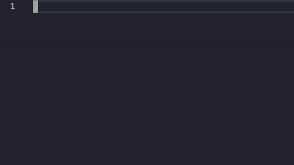
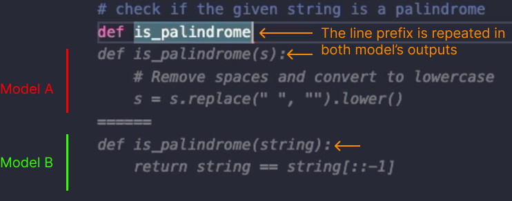
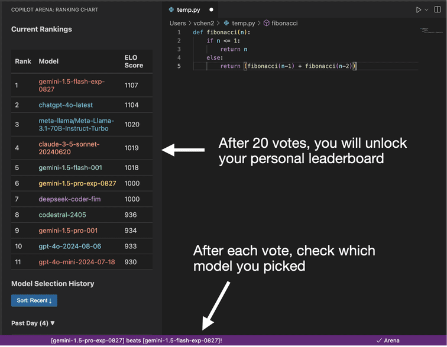

# Copilot Arena

| [**Discord**](https://discord.gg/ftfqdMNh3B) | [**X**](https://x.com/CopilotArena) |

Copilot Arena is an open source AI coding assistant that provides paired autocomplete completions from different LLMs, which include state-of-the-art models like GPT-4o, Codestral, Llama-3.1 and more. 
- Copilot Arena is **free** to use. 
- Our goal is to evaluate which language models provide the best coding assistance. 
- Try it out to find out which models you like coding with!



### Maintainers
[](https://twitter.com/iamwaynechi)
[](https://github.com/waynchi)
[](https://www.waynechi.com/)

[](https://twitter.com/valeriechen_)
[](https://github.com/valeriechen)
[](https://valeriechen.github.io/)

Code coming soon!

## Read This To Get Started

Step 1: Download the Copilot Arena extension from the [Visual Studio Code Store](https://marketplace.visualstudio.com/items?itemName=copilot-arena.copilot-arena). 
- If installed successfully, you will see Arena show up on the bottom right corner of your window. 
- Note, if you are using any other completion provider (e.g. Github Copilot), you must disable them when using Copilot Arena.

Step 2: Read ["How do I use Copilot Arena?"](#how-do-i-use-copilot-arena) below to understand how to interact with paired completions. It's different than your standard autocomplete tool!

Step 3: This step is optional. If applicable, you can change what data is saved by Copilot Arena by following the instructions in ["Privacy Settings"](#privacy-settings).

Step 4: Create a username by clicking the `Copilot Arena` icon on the sidebar; detailed instructions are also in ["Create an account"](#create-an-account). Your username will be used for a future leaderboard to compare individual preferences.

You are now ready to get coding with Copilot Arena!

## How do I use Copilot Arena?
### Understanding Your Completions

When a completion is being generated, the check mark changes to a spinning circle. Once a pair of completions appear, you will notice that Copilot Arena adopts a slightly different user interface compared to a typical code completion.

1. Copilot Arena displays two completions, one on top of the other.
2. Copilot Arena repeats the same line prefix to keep the top and bottom outputs as similar as possible.



### Accepting Completions
Press ```Tab``` to accept the top completion and ```Shift-Tab``` to accept the bottom completion. You can also choose to accept neither completion and continue typing.

### Viewing your model preferences





- When you accept a completion, you can find out which model generated it by checking the status bar. 
- After twenty votes, you will unlock your personal leaderboard, where you can find out which models you prefer and their corresponding elo scores. Based on our experience, everyone will have slightly different model preferences. Stay tuned for a global leaderboard. 
- You can find the personal leaderboard by clicking on the `Copilot Arena` icon on the sidebar.

### Create an account

Soon we will be releasing public leaderboards to compare individual preferences. To enable you to find your position on these leaderboards and help us collect helpful background information, creating an account is as simple as:
- Opening the `Copilot Arena` icon on the sidebar and click `Register`.
- Filling out the requested information.


## Privacy Settings

Your privacy is important to us. Please read carefully to determine which settings are most appropriate for you. 

To generate completions, the code in your current file is sent to our servers and sent to various API providers. This cannot be changed. 

### Data Collection

By default, we collect your code for research purposes. You can opt-out of this. If you are working on code containing sensitive information, we recommend that you opt out of data collection.

- To opt-out of data collection, please change `arena.codePrivacySettings` to `Debug`. We will only log your code for debugging.
- To disable logging entirely, please change `arena.codePrivacySettings` to `Private`. Opting-out means any bugs you encounter will be non-reproducable on our end.

You can find these settings by searching for "arena" in your vscode settings or clicking the gear button of the Copilot Arena extension -> Extension Settings.


### Removing your data

If you would like to have the option in the future for us to delete any of your data, you must create an account on Copilot Arena following instructions described in . To remove your data, you can email any of the Copilot Arena maintainers with your username.


### Data Release

Prior to releasing any collected code snippets to enable future research efforts, we will run a PII detector and remove any identified entities to further ensure no personal information is released.


## Have a question?

If you have feedback or suggestions, please submit an issue or join the conversation on [**Discord**](https://discord.gg/z4yzaj7bf7x)! Check out our [FAQs](FAQ.md). 
